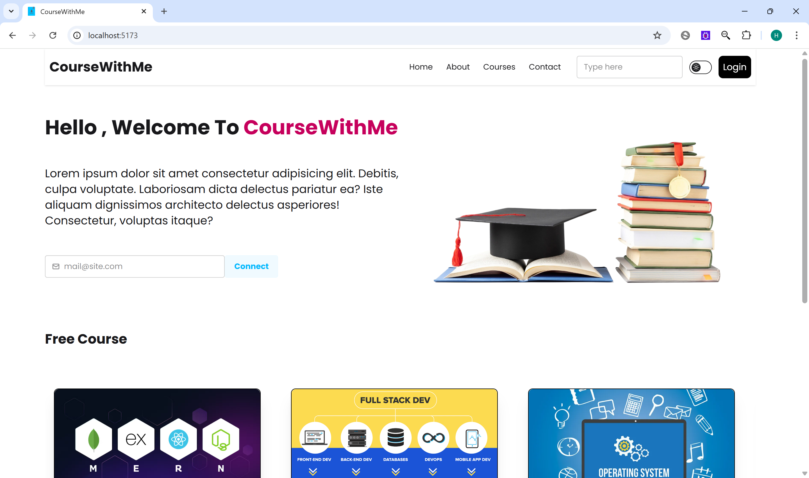
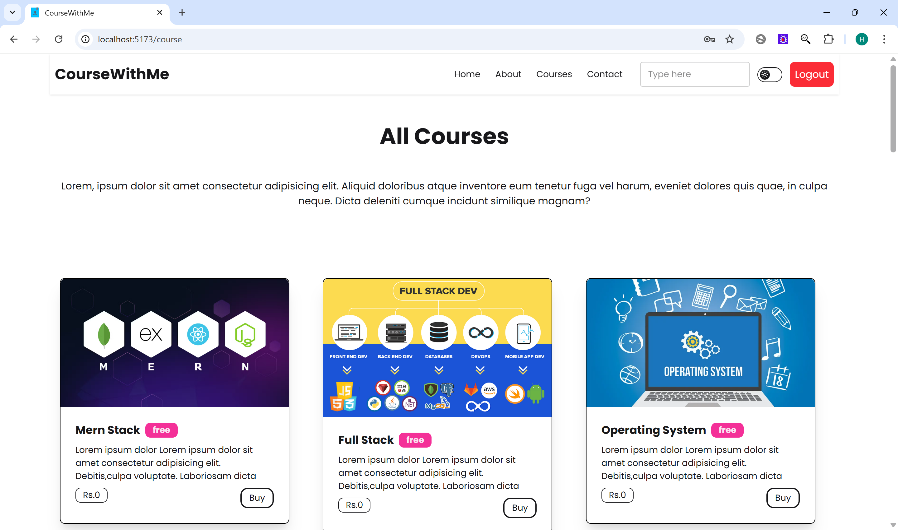
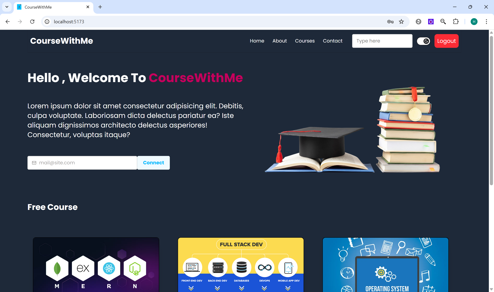

# 🎓 CourseWithMe - Full Stack Web Application


**CourseWithMe** is a full-stack web application built using the MERN stack (MongoDB, Express.js, React.js, Node.js). It allows users to explore educational content, sign up/in, and download resources. Admins can manage the backend course data and user access securely.

---

## 🚀 Features

### 👨‍🎓 User Features:
- 🔐 User Authentication (Signup, Login, Logout)
- 🧑‍🏫 Browse Free & Paid Courses
- 📄 Download Resume
- 🌙 Dark/Light Mode Support
- 📱 Fully Responsive Design

### 🛠 Admin/Backend Features:
- 🧾 REST API with Express & MongoDB
- 🔐 JWT-based Authentication
- 📦 MVC Architecture (Model, Routes, Controller)
- ⚙️ Environment Variable Support

---

## 🧑‍💻 Tech Stack

### Frontend:
- React.js
- Tailwind CSS
- React Router
- React Hot Toast

### Backend:
- Node.js
- Express.js
- MongoDB (Mongoose)
- JWT for Authentication

---

## 📂 Project Structure

```
CourseWithMe/
├── Backend/
│   ├── controller/
│   ├── model/
│   ├── route/
│   ├── .env
│   └── index.js
├── Frontend/
│   ├── public/
│   ├── src/
│   │   ├── components/
│   │   ├── Context/
│   │   ├── About/
│   │   ├── Contact/
│   │   └── App.jsx
│   └── package.json
└── README.md
```

---

## ⚙️ Installation & Setup

### 1. Clone the repository

```bash
git clone https://github.com/harshalgondane33/CourseWithMe-Full-Stack-Web-Application.git
cd CourseWithMe-Full-Stack-Web-Application
```

---

### 2. Setup Backend

```bash
cd Backend
npm install
```

Create a `.env` file in the `Backend` directory and add:

```env
MONGO_URL=your_mongo_connection_string
JWT_SECRET=your_jwt_secret
PORT=8080
```

Start backend server:
```bash
node index.js
```

---

### 3. Setup Frontend

```bash
cd ../Frontend
npm install
npm run dev
```

---

## 📸 Screenshots


| Home Page | Course Section | Dark Mode |
|-----------|----------------|-----------|
|  |  |  |

---

## 🔒 Environment Variables (`Backend/.env`)

```env
MONGO_URL=your_mongodb_connection_string
JWT_SECRET=your_secret_key
PORT=8080
```

---

## 📦 Dependencies

### Frontend:
- `react`
- `react-router-dom`
- `tailwindcss`
- `react-hot-toast`

### Backend:
- `express`
- `mongoose`
- `jsonwebtoken`
- `dotenv`
- `cors`

---

## 💡 Future Improvements

- Admin dashboard panel
- Payment gateway for paid courses
- User profile and history tracking
- Upload/download course videos

---

## 🙋‍♂️ Author

**Harshal Gondane**  
[GitHub](https://github.com/harshalgondane33) | [LinkedIn](https://www.linkedin.com/in/harshalgondane33/)

---

## 📄 License

This project is licensed under the MIT License.  
See the [LICENSE](./LICENSE) file for details.

---
